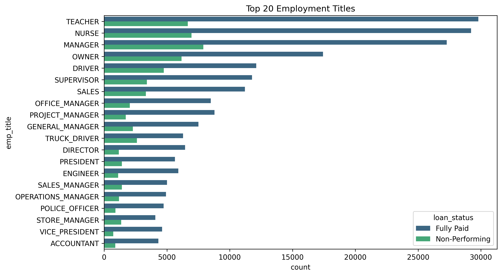
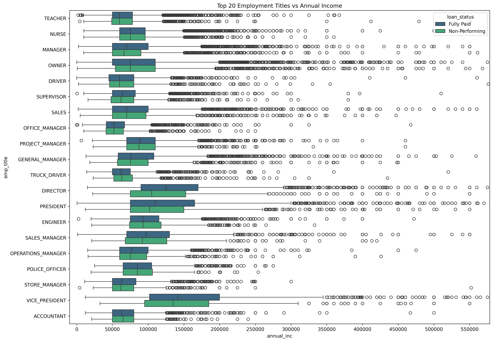
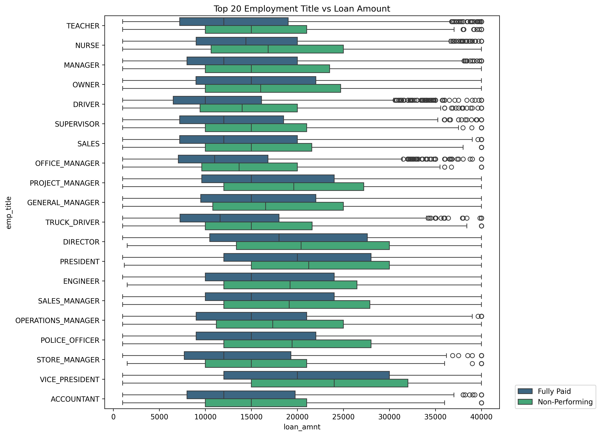

# Default prediction to optimize loan portfolio performance

## Introduction
LendingClub is an early peer-to-peer lending network for borrowers seeking loans between $1,000 to $40,000.  These loans are funded by investors who are looking for higher-than-normal returns on their capital.  Since these loans are unsecured, investors need to perform their own due diligence to minimize loss of original investment and maximize returns.

To help investors in the decisioning process, LendingClub makes available many borrower and loan-specific information.  Borrower information include demographic and economic details such as location, employment, income, credit scores, and more.  In addition, information on interest rate, term duration, and purpose are provided for each loan.

The goal of this project is to evaluate several ML classification models to determine their effectiveness in predicting whether a LendingClub loan will be fully paid.  Investors can use these predictions to optimize their capital allocations for maximum profit.

## Rationale
Optimizing loan portfolio performance is a fundamental use case for banks and lenders.  Classification models play an important role by helping to predict default risk for a borrower -- enabling lenders to minimize loan losses through better decisions on loan funding.

## Data Sources
The LendingClub dataset contained over 2.8 million loan records spanning the period 2007 through Q3 2020.  It is available for download from [Kaggle](https://www.kaggle.com/datasets/ethon0426/lending-club-20072020q1).

## Methodology

We will employ many phases of [CRISP-DM](https://en.wikipedia.org/wiki/Cross-industry_standard_process_for_data_mining) in this project to explore, clean, and prepare the data for modeling.

## Data Preprocessing
This is a high dimensional dataset with 142 features.

The target variable is `loan_status`.  A breakdown of loans by statuses:


For this effort, we primarily care about data that would help us make a prediction on whether a loan will be fully paid or not.  Using [LendingClub's definition for each loan status](./data/What%20Do%20the%20Different%20Note%20Statuses%20Mean.pdf), we decided to map the target variable down to two classes:
* `Fully Paid`
* `Non-Performing`:  include all `Late (31-120 days)`, `Default`, and `Charged Off` loans 

By categorizing `Late (31-120 days)` and `Default` loans the same as `Charged Off`, we are taking a conservative approach to further minimize risk for investors.

Loans in other statuses are dropped since their outcome has not been determined.

After reviewing [LendingClub's companion data dictionary](./data/LCDataDictionary.xlsx), the following features were pruned:
* Features where data would only be available after the loan has been funded.  Obviously, these would not be useful since our goal is to help determine whether or not the loan should be funded in the first place.
* `id`, `member_id`, and `url`.  These are useful as indices, but not useful for our model.
* `desc`; this is the loan description provided by the borrower.  This information is formally categorized by LendingClub in another feature called `purpose`.
* Features with high percentage of missing values:


After this initial pass, we are left with 32 features, some still with missing values.  Further examination of each feature by `issue_d`, we see variations in the earliest non-NULL value.  This indicates that some features were added over time to the dataset.
```
Earliest non-Null value for [ addr_state ]: 			2007-06-01 00:00:00
Earliest non-Null value for [ annual_inc ]: 			2007-06-01 00:00:00
Earliest non-Null value for [ application_type ]: 			2007-06-01 00:00:00
Earliest non-Null value for [ avg_cur_bal ]: 			2012-08-01 00:00:00
Earliest non-Null value for [ bc_util ]: 			2012-03-01 00:00:00
Earliest non-Null value for [ chargeoff_within_12_mths ]: 			2007-08-01 00:00:00
Earliest non-Null value for [ delinq_2yrs ]: 			2007-06-01 00:00:00
Earliest non-Null value for [ dti ]: 			2007-06-01 00:00:00
Earliest non-Null value for [ emp_length ]: 			2007-06-01 00:00:00
Earliest non-Null value for [ emp_title ]: 			2007-06-01 00:00:00
Earliest non-Null value for [ fico_range_high ]: 			2007-06-01 00:00:00
Earliest non-Null value for [ fico_range_low ]: 			2007-06-01 00:00:00
Earliest non-Null value for [ grade ]: 			2007-06-01 00:00:00
Earliest non-Null value for [ home_ownership ]: 			2007-06-01 00:00:00
Earliest non-Null value for [ il_util ]: 			2015-12-01 00:00:00
Earliest non-Null value for [ inq_fi ]: 			2015-12-01 00:00:00
Earliest non-Null value for [ inq_last_12m ]: 			2015-12-01 00:00:00
Earliest non-Null value for [ inq_last_6mths ]: 			2007-06-01 00:00:00
Earliest non-Null value for [ installment ]: 			2007-06-01 00:00:00
Earliest non-Null value for [ int_rate ]: 			2007-06-01 00:00:00
Earliest non-Null value for [ issue_d ]: 			2007-06-01 00:00:00
Earliest non-Null value for [ loan_amnt ]: 			2007-06-01 00:00:00
Earliest non-Null value for [ loan_status ]: 			2007-06-01 00:00:00
Earliest non-Null value for [ mths_since_last_delinq ]: 			2007-06-01 00:00:00
Earliest non-Null value for [ purpose ]: 			2007-06-01 00:00:00
Earliest non-Null value for [ revol_bal ]: 			2007-06-01 00:00:00
Earliest non-Null value for [ revol_util ]: 			2007-06-01 00:00:00
Earliest non-Null value for [ sub_grade ]: 			2007-06-01 00:00:00
Earliest non-Null value for [ term ]: 			2007-06-01 00:00:00
Earliest non-Null value for [ verification_status ]: 			2007-06-01 00:00:00
```

We felt the addition of `avg_cur_bal` was important so we chose a cut-off date of `2012-08-01`.  All records with `issue_d` prior to this date were pruned.  Fortunately, only 3.4% of the records (or 62936) were pruned, leaving us still with over 1.81M records.

At this point, our remaining missing values were:

```
annual_inc                       0
application_type                 0
avg_cur_bal                   4642
bc_util                      21481
chargeoff_within_12_mths         0
delinq_2yrs                      0
dti                           1138
emp_length                       0
emp_title                   130266
fico_range_high                  0
fico_range_low                   0
grade                            0
home_ownership                   0
il_util                     928539
inq_fi                      783870
inq_last_12m                783871
inq_last_6mths                   1
installment                      0
int_rate                         0
issue_d                          0
loan_amnt                        0
loan_status                      0
mths_since_last_delinq      912350
purpose                          0
revol_bal                        0
revol_util                    1344
sub_grade                        0
term                             0
verification_status              0
```

A few features had less than 2% missing values:  `avg_cur_bal`, `bc_util`, `dti`, `inq_last_6mths`, and `revol_util`.  We proceeded to drop records where 
there were missing values in one or more of these features.  For this pass, 27115 records (< 1.5% of records) were dropped.

Features `il_util`, `inq_fi`, `inq_last_12m`, and `mths_since_last_delinq` had over 40% missing values; these columns were dropped.

**Our cleaned dataset ended with 26 features and ~1.79M records.**  [[statistical report]](https://html-preview.github.io/?url=https://github.com/dmtrinh/loan-default-prediction/blob/main/output/data_profile_report_after_cleaning.html)

## Exploratory Data Analysis

By plotting a word cloud of `emp_title`, we can easily see the most popular professions of those taking out loans.


Since the Top 20 job titles make up ~14.7% of the total loan population, we will use them as a representative sample to identify some trends.


The mean ratio of Non-Performing to Fully Paid loans is ~27.2%.  As hinted by our sample, job titles _may_ be a predictor variable; some job titles (e.g. Drivers) will have substantially higher non-performing ratios.


Generally, the median annual income for borrowers who fully repay their loans is higher than those who default.


Conversely, the median loan amount for borrowers who fully repay their loan is lower than those who default. 


### Plotting predictor variables against loan_status


### Correlation matrix
