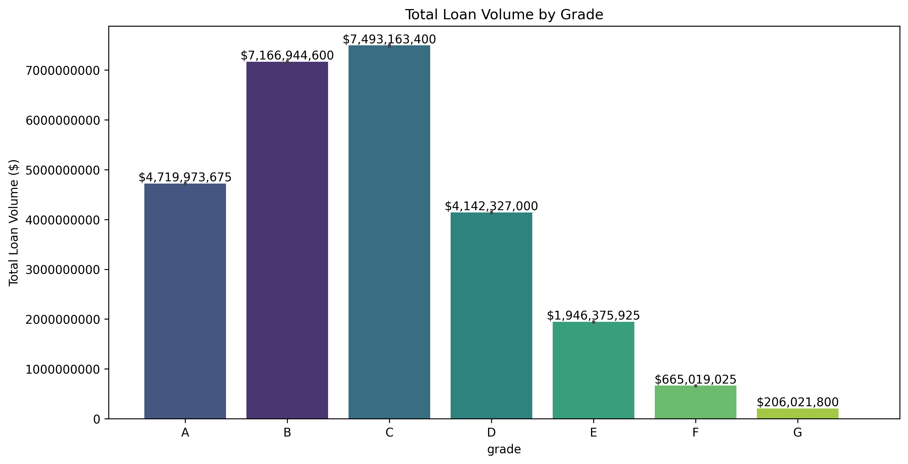

# Default prediction to optimize loan portfolio performance

## Introduction
LendingClub is an early peer-to-peer lending network for borrowers seeking loans between $1,000 to $40,000.  These loans are funded by investors who are looking for higher-than-normal returns on their capital.  Since these loans are unsecured, investors are expected to perform additional due diligence to maximizie returns from loan interest payments and minimize loss of any prinicipal investment.

To help investors in the decisioning process, LendingClub makes available many borrower and loan-specific information.  Borrower information include demographic and economic details such as location, employment, income, credit scores, and more.  In addition, information on interest rate, term duration, and purpose are provided for each loan.

The goal of this project is to evaluate several ML classification models to determine their effectiveness in predicting whether a LendingClub loan will be fully paid.  Investors can use these models to optimize their capital allocations for maximum profit.

### Rationale
Optimizing loan portfolio performance is a fundamental use case for banks and lenders.  Classification models play an important role by helping to predict default risk for a borrower -- enabling lenders to minimize loan losses through better decisions on loan funding.

## Data Sources
The LendingClub dataset contained over 2.8 million loan records spanning the period 2007 through Q3 2020.  It is available for download from [Kaggle](https://www.kaggle.com/datasets/ethon0426/lending-club-20072020q1).

## Methodology

We will employ many phases of [CRISP-DM](https://en.wikipedia.org/wiki/Cross-industry_standard_process_for_data_mining) in this project to explore, clean, and prepare the data for modeling.

## Data Preprocessing
This is a high dimensional dataset with 142 features.

The target variable is `loan_status`.  A breakdown of loans by statuses:


For this effort, we primarily care about data that would help us make a prediction on whether a loan will be fully repaid or not.  Using [LendingClub's definition for each loan status](./data/What%20Do%20the%20Different%20Note%20Statuses%20Mean.pdf), we decided to map the target variable down to two classes:
* `Fully Paid`
* `Non-Performing`:  includes all `Late (31-120 days)`, `Default`, and `Charged Off` loans 

By categorizing `Late (31-120 days)` and `Default` loans the same as `Charged Off`, we are taking a conservative approach to further minimize risk for investors.

Loans in other statuses are dropped since their outcome has not been determined.

After reviewing [LendingClub's companion data dictionary](./data/LCDataDictionary.xlsx), the following features were pruned:
* Features where data would only be available after the loan has been funded.  Obviously, these would not be useful since our goal is to help determine whether or not the loan should be funded in the first place.
* `id`, `member_id`, and `url`.  These are useful as indices, but not useful for our model.
* `desc`; this is the loan description provided by the borrower.  This information is formally categorized by LendingClub in another feature called `purpose`.
* Features with high percentage of missing values:


After this initial pass, we are left with 32 features, some still with missing values.  Further examination of each feature by loan issue date (`issue_d`), we see variations in the earliest non-NULL value.  This indicates that some features were added by LendingClub over time to the dataset.

We felt that the average current balance of all accounts (`avg_cur_bal`) for a borrower could be a useful predictor.  `avg_cur_bal` was introduced on `2012-08-01`; this date was used as our cut-off date.  All loan records with `issue_d` prior to this date were dropped.  Fortunately, only 3.4% of the records (or 62936) were affected, leaving us still with over 1.81M records.

At this point, our remaining missing values were:

```
avg_cur_bal                 4642
bc_util                    21481
dti                         1138
emp_title                 130266
il_util                   928539
inq_fi                    783870
inq_last_12m              783871
inq_last_6mths                 1
mths_since_last_delinq    912350
revol_util                  1344
```

Given the small impact to the dataset, we proceeded to drop records where there were missing values in `avg_cur_bal`, `bc_util`, `dti`, `inq_last_6mths`, or `revol_util`.  For this pass, 27115 records (< 1.5% of total records) were dropped.

Features `il_util`, `inq_fi`, `inq_last_12m`, and `mths_since_last_delinq` had over 40% missing values; these features were pruned.

**Our cleaned dataset ended with 28 features and ~1.79M records.**  [[statistical report]](https://html-preview.github.io/?url=https://github.com/dmtrinh/loan-default-prediction/blob/main/output/data_profile_report_after_cleaning.html)

Here's the loan distribution after cleaning:


## Exploratory Data Analysis

The vast majority of loans were used for debt consolidation and credit cards.


Interestingly, higher than normal non-performing loans are concentrated in the [Deep South states](https://en.wikipedia.org/wiki/Deep_South).

Note: The LendingClub dataset has very limited number of loans from Iowa (colored in off-white on the map)

### Loan Grade

LendingClub assigns a grade to each loan based on risk levels.  Grade `A` loans are the safest, but yielding the lowest returns.  Conversely, grade `G` loans have an average interest rate of over 28% -- approximately 4 times the rate of grade `A` loans -- but are more likely to not be fully repaid. 


Each `grade` is further divided into 5 `sub_grade` levels for finer-grained categorization.

| grade | sub_grade |
| ------------- | ------------- |
| `A` | `A1` `A2` `A3` `A4` `A5` |
| `B` | `B1` `B2` `B3` `B4` `B5` |
| `C` | `C1` `C2` `C3` `C4` `C5` |
| `D` | `D1` `D2` `D3` `D4` `D5` |
| `E` | `E1` `E2` `E3` `E4` `E5` |
| `F` | `F1` `F2` `F3` `F4` `F5` |
| `G` | `G1` `G2` `G3` `G4` `G5` |



### FICO Scores

The vast majority of loan volume comes from borrowers with less than 725 FICO scores.  This is somewhat expected.  While 725 is an "acceptable" score [[source](https://www.experian.com/blogs/ask-experian/credit-education/score-basics/725-credit-score/)], these borrowers likely did not qualify for prime lending rates with more traditional lenders - especially for unsecured loans.


More interestingly, however, is only 10 points separate borrowers who fully paid back their loans vs those who didn't.


### Top 20 Job Titles

By plotting a word cloud of `emp_title`, we can easily see the most popular professions of those taking out loans.


Since the Top 20 job titles make up > 15% of the total loan population, we will use them as a representative sample population to identify some trends.


The mean ratio of Non-Performing to Fully Paid loans is ~26%.  As hinted by our sample population, job titles _may_ be a convenient predictor variable; some job titles (e.g. Drivers) will have substantially higher non-performing ratios.


Furthermore, **borrowers' income** and/or **loan amount** _relative to their profession_ may also be useful predictors for loan repayment.  Generally, borrowers making more than the [median annual income for their profession](./output/emp_title_top20_vs_annual_inc2.png) are more likely to fully repay their loans.  Borrowers who take out a [lower-than-median loan amount for their profession are also less likely to default](./output/emp_title_top20_vs_loan_amnt.png).

### Plotting predictor variables against loan_status


### Reducing multicollinearity in our dataset 
Multicollinearity can significantly impact the reliability and interpretability of our models.  Multicollinearity occurs when two or more independent variables are highly correlated.  The [correlation matrix](./output/correlation_matrix.png) shows high-correlation between these predictors:
* `revol_util` and **`bc_util`**
* `grade`, **`sub_grade`**, and `int_rate`
* `installment` and **`loan_amnt`**
* `fico_range_high`, `fico_range_low`, and **`fico_range_avg`**

To reduce multicollinearity, we kept the predictors in **bold** and dropped the others from our dataset in preparation for the modeling phase.

## Model Development

For this effort, we trained four classification models:
* Logistic Regression
* Decision Tree
* Gradient Boost Classifier
* Feedforward Neural Network (using Keras' Sequential model)

To improve model performance and speed up convergence, we performed feature scaling using this preprocessing pipeline:


## Model Evaluation and Recommendations
To maximize return on investment, we need to identify loans that are likely to be fully repaid and have high yields.

A mis-classification for a `Fully Paid` loan (i.e. False Positive) would result in a loss of principal for investors.  On the other hand, a mis-classification for a `Non-Performing` loan (i.e. False Negative) means investors will miss out on income generated by the high interest rate on the loan.

We suspect most investors considering these loans will favor protecting their principal over interest income, which means we will need to minimize false positives.  Hence, precision is the most appropriate metric to use for our model evaluation.

|   Model  | Precision |  Recall   |    F1    |
|:-:|:-:|:-:|:-:|
| Logistic Regression | 0.8045 | 0.9818 | 0.8844 |
| Decision Tree | 0.7985 | **0.9903** | 0.8841 |
| Gradient Boosting Classifier | 0.8055 | 0.9824 | **0.8852** |
| Feedforward Neural Network | **0.8154** | 0.9518 | 0.8784 |

The models performed comparably and scored within a few percentage points of each other across precision, recall, and F1 scores.

The risk appetite of each investor will ultimately determine which model we use to help them with their loan investment decision:
* For very **cautious investors** who prioritize being fully repaid over maximum profit, our **Feedforward Neural Network** model would be most appropriate.  This model has high precision and low recall; it **minimizes the risk of misclassifying bad loans, but may result in many good loans being rejected**.

* For **risk-seeking investors**, our **Decision Tree** model would perform better.  This model has high recall and low precision; it **maximizes the classification of good loans, but increases the risk of misclassifying bad loans**.

Optimizing loan portfolio performance can be very complex and need to take into account many aspects including credit risk management, diversification, and other investor preferences.  Although we have only scratched the surface in this project, we hope others will find our work a useful starting point for their own endeavors.
