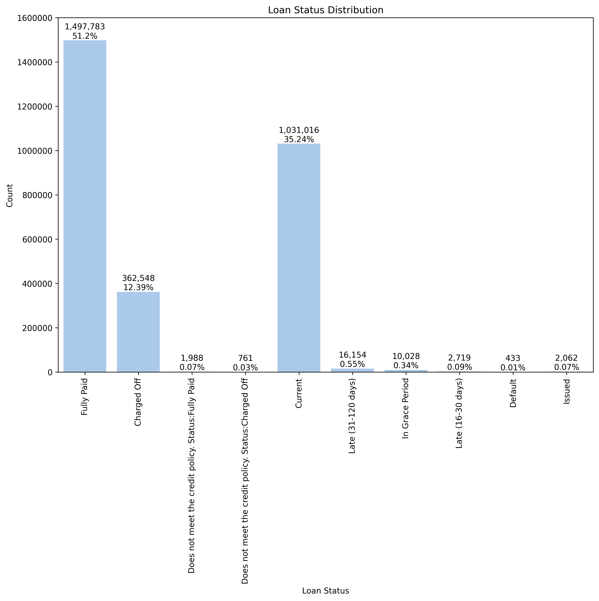

# Default prediction to optimize loan portfolio performance

## Introduction
LendingClub is an early peer-to-peer lending network for borrowers seeking loans between $1,000 to $40,000.  These loans are funded by investors who are looking for higher-than-normal returns on their capital.  Since these loans are unsecured, investors need to perform their own due diligence to minimize loss of original investment and maximize returns.

To help investors in the decisioning process, LendingClub makes available many borrower and loan-specific information.  Borrower information include demographic and economic details such as location, employment, income, credit scores, and more.  In addition, information on interest rate, term duration, and purpose are provided for each loan.

The goal of this project is to evaluate several ML classification models to determine their effectiveness in predicting whether a LendingClub loan will be fully paid.  Investors can use these predictions to optimize their capital allocations for maximum profit.

## Rationale
Optimizing loan portfolio performance is a fundamental use case for banks and lenders.  Classification models play an important role by helping to predict default risk for a borrower -- enabling lenders to minimize loan losses through better decisions on loan funding.

## Data Sources
The dataset contains over 2.8 million loan records on the LendingClub platform spanning 2007 through Q3 2020.  It is available for download from [Kaggle](https://www.kaggle.com/datasets/ethon0426/lending-club-20072020q1)

## Methodology

We will employ many phases of [CRISP-DM](https://en.wikipedia.org/wiki/Cross-industry_standard_process_for_data_mining) in this project to explore, clean, and prepare the data for modeling.

## Data Preprocessing and Exploratory Data Analysis
The LendingClub dataset is high dimensional with 142 features.

After reviewing [LendingClub's companion data dictionary](./data/LCDataDictionary.xlsx), the following features were pruned:
* Features with high percentage of missing values:

* Features where data would only be available after the loan has been funded.  Obviously, these would not be useful since our goal is to help determine whether or not the loan should be funded in the first place.
* Features where data was not captured prior to `2012-08-01`
* `id`, `member_id`, and `url`.  These are useful as indices, but not useful for our model.
* `desc`.  This information is formally categorized in loan `purpose` by LendingClub.

A breakdown of loans by statuses:

